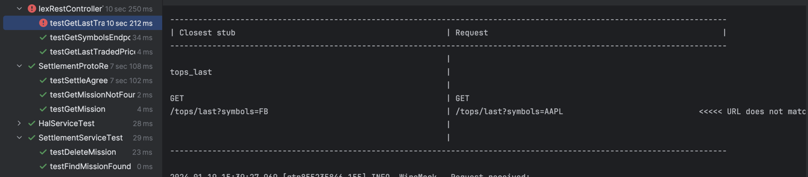
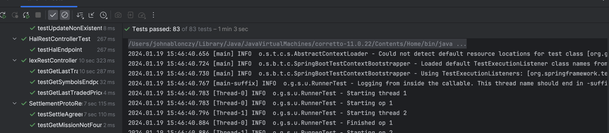

Issue Description
--
IexRestController test is failing. This test should be passing.

Design
--
Due to a merge issue, the wiremock data does not match the test. The data in the wiremock and test needs to be modified to match.

Test Evidence
--

Validation in Develop
-- 
[Proof issue is resolved in Develop. Should be complete before Issue is closed]
